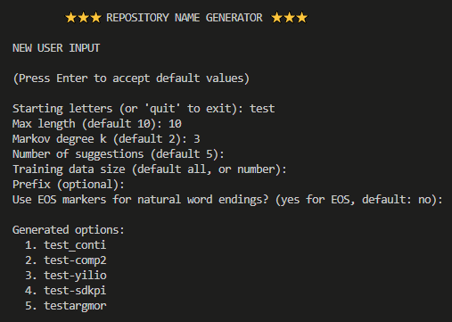
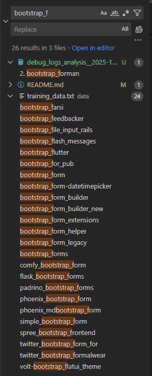
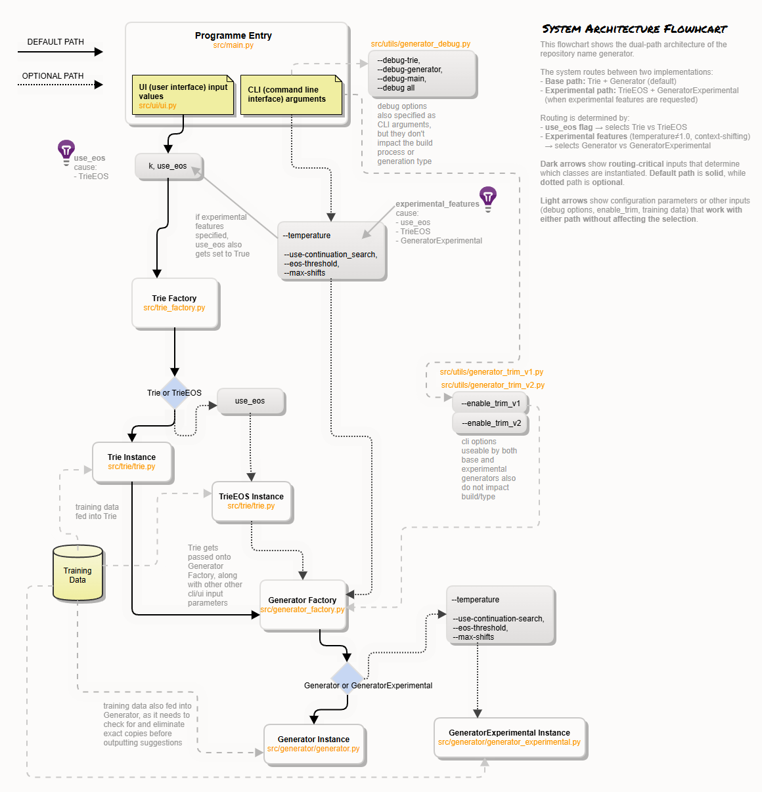
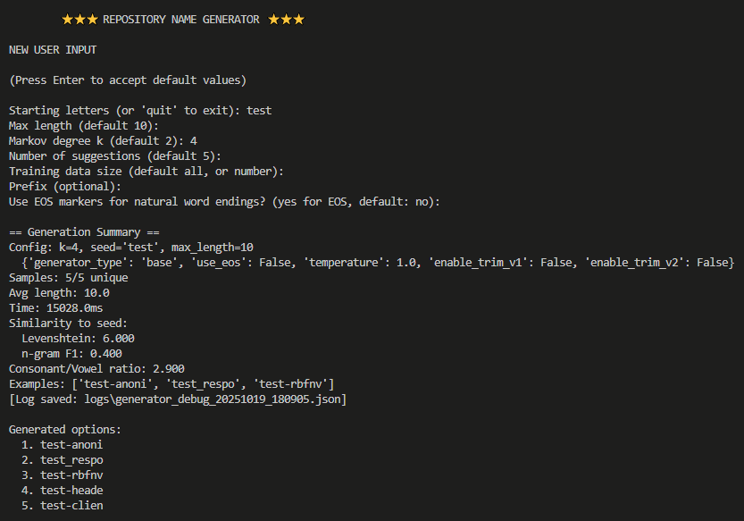
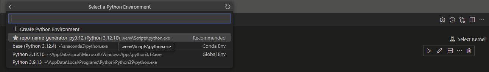
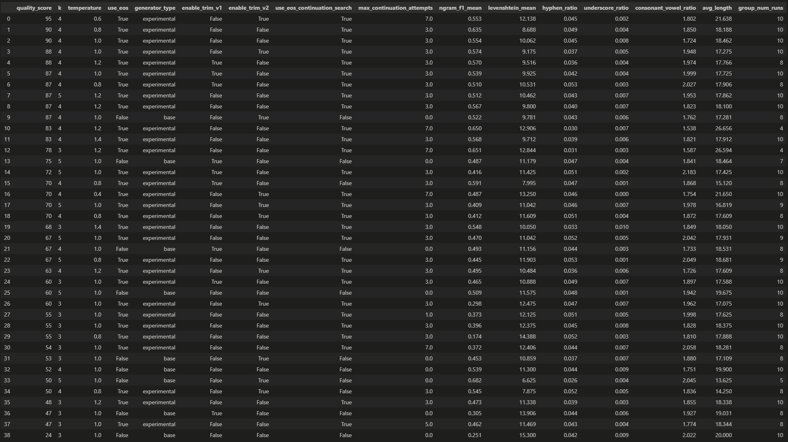

# repo-name-generator

Aineopintojen harjoitustyö: Algoritmit ja tekoäly (2025)

***sisältö***
- [1. Ohjelman yleiskuvaus](#1-ohjelman-yleiskuvaus)
- [2. Asennus ja käynnistys](#2-asennus-ja-käynnistys)
  - [2.1. Asennus](#21-asennus)
  - [2.2. Käynnistys](#22-käynnistys)
- [3. Ajot eri syöteillä ja asetuksilla](#3-ajot-eri-syöteillä-ja-asetuksilla)
  - [3.1. Syötteet](#31-syötteet)
  - [3.2. Asetukset](#32-asetukset)
  - [3.3. Suositus syötteet ja asetukset](#33-suositus-syötteet-ja-asetukset)
- [4. Arkkitehtuuri ja suoritusaikainen toiminta](#4-arkkitehtuuri-ja-suoritusaikainen-toiminta)
  - [4.1. Arkkitehtuuri](#41-arkkitehtuuri)
  - [4.2. Suoritusaikainen toiminta](#42-suoritusaikainen-toiminta)
- [5. Toiminnan analyysi ja tarkistukset](#5-toiminnan-analyysi-ja-tarkistukset)
  - [5.1. Debug tulostukset](#51-debug-tulostukset)
  - [5.2. Notebook-raportointi](#52-notebook-raportointi)
  - [5.3. Yksikkötestit (Pytest)](#53-yksikkötestit-pytest)
  - [5.4. Staattinen analyysi (Pylint)](#54-staattinen-analyysi-pylint)
- [6. Suorituskyky](#6-suorituskyky)
- [7. Ohjelman käyttötarkoitukset ja jatkokehitys](#7-ohjelman-käyttötarkoitukset-ja-jatkokehitys)

---

### 1. Ohjelman yleiskuvaus

> Repository Name Generator on komentorivisovellus, joka generoi realistisia ja merkityksellisiä nimiä projekteille, repositorioille ja paketeille.     

>  Sovellus oppii k-gram -pohjaisen merkkitason Markov-mallin suuresta määrästä oikeita repo-/pakettinimiä ja tuottaa uusia, dataa muistuttavia nimiehdotuksia, käyttäjän antaman alkusanan pohjalta.   

>  Ydin toteutetaan omalla trie-rakenteella, jossa jokaiselle k-grammille talletetaan seuraavan merkin frekvenssijakauma jota Markov-generaattori hyödyntää.  

> Generointia voidaan muunnella ja hienosäätää monilla eri asetuksilla ja syötteillä (esim. k-aste, frekvenssijakauman muunnokset tai generoitavan sanan pituuden määrittely.)

> Toimintaa ja tuloksia voi tarkastella debug-tulostuksista/lokeista, ja lokeja voi analysoida mukana tulevalla Jupyter-notebookilla.

Sovelluksessa on kaksi generaattoria:

- **Perusgeneraattori**: Oletustoiminta, deterministinen generointi joka tuottaa dataa muistuttavia nimiä satunnaisuuden muokkaamista.
- **Kokeellinen generaattori**: Temperature-säätö, EOS-merkinnät luonnollisille päättymisille, jatkohaku optimaalisen pituuden saavuttamiseksi.

Keskeiset ominaisuudet:

- **Valittava k-aste (2–5):** suurempi *k* $\Rightarrow$ koherentimpia, dataa muistuttavia nimiä; pienempi *k* $\Rightarrow$ luovempi, satunnaisempi.
- **Seed-pohjainen generointi:** kaikki tulokset alkavat annetusta alkusanasta.
- **Välimuisti:** trie rakennetaan uudestaan vain k/datakoon/EOS-asetuksen muuttuessa; generaattori vain omien asetustensa muuttuessa.
- **EOS-tuki ja jatkohaku:** oppii luonnolliset päättymiskohdat ja voi jatkaa polkua ennenaikaisen EOS:in jälkeen.
- **Trimmaus:** siivoaa epäluonnolliset loput (esim. keskeneräiset tavut tai ripustimet).
- **Temperature:** säätää todennäköisyysjakaumaa: pienempi (< 1.0) korostaa todennäköisiä jatkoja → konservatiivisempi; suurempi (> 1.0) tasaa jakaumaa → luovempi. Oletus: 1.0.

---

### 2. Asennus ja käynnistys

#### 2.1. Asennus 

Varmista Poetry-ympäristö projektin sisään (suositus):
```bash
poetry config virtualenvs.in-project true
```

Asenna riippuvuudet (ensimmäisellä kerralla):

```bash
poetry install
```

HUOM: Jos `poetry shell` antaa seuraavanlaisen virheen   
`Split-Path ... Cannot bind argument to parameter 'Path' because it is null`,   
ohita aktivointi ja käytä suoraan `poetry run`, tai aja korjausskripti:

```powershell
# vaihtoehto 1: ohita aktivointi
poetry run pytest -q

# vaihtoehto 2: korjaa venvin activate.ps1 ja käytä shelliä
pwsh -File .\scripts\patch-activate.ps1
poetry shell
```
#### 2.2. Käynnistys

Käynnistä poetry:

```bash
poetry shell
```

Käynnistä sovellus:

```bash
python -m src.main
```
  
Tarkemmat käynnistys- ja ajoohjeet mm. ajoihin eri vaihtoehdoilla enabloituna löytyvät alla.

---

### 3. Ajot eri syöteillä ja asetuksilla

#### 3.1. Syötteet

Käynnistyttyään ohjelma ohjaa käyttäjää interaktiivisen valikon kautta. Ohjelma kysyy seuraavat parametrit:

1. Aloitussana/merkkijono 
    - Mistä merkeistä generoitu nimi alkaa (esim. `data`, `api`, `web`)
2. Maksimipituus 
    - Generoitavan nimen maksimipituus merkkeinä (esim. `12`)
3. K-arvo 
    - Markov-mallin aste, eli kuinka monta edellistä merkkiä huomioidaan seuraavaa ennustaessa (suositus: `2-4`)
    - Pieni k (2) tuottaa luovempia mutta satunnaisempia nimiä. Suurempi k (3-4) tuottaa realistisempia mutta konservatiivisempia nimiä, jotka muistuttavat enemmän opetusdataa.
    - Ohjelma säilyttää trie-rakenteen muistissa. Jos käytät samaa k-arvoa, datan kokoa ja EOS-asetusta uudelleen, generointi on huomattavasti nopeampaa.
4. Ehdotusten määrä 
    - Kuinka monta nimiehdotusta generoidaan (esim. `5`)
5. Datan koko 
    - Kuinka monta riviä opetusdataa käytetään (oletus/max: `1500000`)
    - Pienempää datamäärää tulee lähinnä käyttää jos trien debug on käytössä
6. EOS-tokenien käyttö 
    - Käytetäänkö End-Of-Sequence -tokeneita sanojen päättymisen oppimiseen 
    - Parantaa sanojen luonnollista päättymistä oppimalla mistä kohdasta sanat tyypillisesti loppuvat opetusdatassa.
    - Altistaa kuitenkin generointien ennenaikaiselle lopettamiselle
7. Etuliite 
    - Voidaan valinnaisesti lisätä kaikkiin generoituihin nimiin (esim. `sys-`, `lib-`)

Allaoleva kuva havainnollistaa UIn käyttöä:



#### 3.2. Asetukset

Ohjelma tukee useita komentoriviparametreja, joilla voidaan säätää toiminnallisuutta.

```bash

# DEBUG

# Näytä trie-rakenteen debug-tiedot
python -m src.main --debug-trie

# Näytä generaattorin debug-tiedot ja tallenna JSON-lokit
python -m src.main --debug-generator

# Näytä pääsilmukan debug-tulosteet
python -m src.main --debug-main

# Kaikki debug-tilat kerralla
python -m src.main --debug-all

# TRIM

# Käytä delimiter-pohjaista trimmausta
python -m src.main --enable-trim-v1

# Käytä morfologisesti tietoista trimmausta (suositeltu)
python -m src.main --enable-trim-v2

# KOKEELLISET OMINAISUUDET

# Säädä lämpötilaa (oletus: 1.0, pienempi = konservatiivisempi, eli valitsee vierlä todennäköisemmin todennäköiset jatkajat)
python -m src.main --temperature 0.8

# Aktivoi EOS-jatkohaku (vaihtoehtoisten polkujen tutkiminen eos lopetuksessa, ennen estimoitua optimaalista päättymispituutta)
python -m src.main --use-eos-continuation-search

# Aseta EOS-todennäköisyyskynnys (jatkohakuun liittyen, oletus: 0.4)
python -m src.main --eos-threshold 0.5

# Maksimi jatkohakuyritykset (jatkohakuun liittyen, oletus: 3)
python -m src.main --max-continuation-attempts 5
```

Yhdistelmäesimerkkejä:

```bash
# Debug-tila morfologisella trimmauksella
python -m src.main --debug-generator --enable-trim-v2

# Kokeellinen tila matalalla lämpötilalla ja EOS-jatkohaulla
python -m src.main --temperature 0.7 --use-eos-continuation-search --eos-threshold 0.3

# Täysi debug kokeellisilla ominaisuuksilla
python -m src.main --debug-all --temperature 0.9 --use-eos-continuation-search # asetta UI:ssa data-size pinemmäksi jos debug trie/all
```

Huomioitavaa:
- Kokeellinen tila aktivoituu automaattisesti kun `--temperature` poikkeaa arvosta 1.0 tai `--use-eos-continuation-search` on käytössä
- Debug-generaattori tallentaa JSON-lokit automaattisesti `logs/`-hakemistoon
- Trim-algoritmit ovat toisensa poissulkevia - voit käyttää vain toista kerrallaan

#### 3.3. Suositus syötteet ja asetukset

- Nimien tulisi olla sellaisia että niitä oikeasti voitaisiin käyttää repojen niminä sellaisenaan, 
- Koska generoidut nimet ovat usein yhdistelmä sanoja, sanoissa tulisi kokonaisuutena myös olla yhteensopivuutta (esim. huippu-ohjain [ok] vs. huippu-tarvitsen [ei niin ok])   
- Tässä mielessä myös innovatiiviset yhdistlmät ovat laadun merkki, toisaalta yhdistelmät eivät pelkästään saisi olla yhdistelmiä olemasaolevista sanoista

Tässä on esitettynä kaksi suositusta jotka johtavat laadukkaisiin tuloksiin.

**Perusgeneraattorille**

Hyvät tulokset repo-nimien generointiin ilman muita kuin perus generattorin ja trien toiminnalisuuksia hyödyntäen, saa esimerkiksi seuraavin kutsuin/parametrein.

Trim on ainoa lisä-toiminnallisuus jota perus generaattori voi hyödyntää. Tämä leikkaa sanojen lopusta sellaiset postfixit jotka eivät vaikuta sanojen luonnollisilta lopetuksilta, esim -ba

```bash
python -m src.main --enable-trim-v2
```

UI-syötteet
```code
- Starting letters     : trigger  (esimerkiksi)
- Max length           : 20       (tarpeeksi kirjaimia jotta generointi voi kehittää järkeviä nimityksiä)
- Markov degree k      : 4 / 5    (isompi k tarkoittaa yleisesti parempi-laatuisia tuloksia, joskin sanat eivät vältämättä ole innovatiivisia, k=4 pitää hyvän tasapainon)
- Number of suggestions: default  (5, tai oman mielen mukaan)
- Training data size   : default  (käytetään kaikki harjoitusdata)
- prefix               :          (oman mielen mukaan)
- Use EOS markers      : default  (base triessä ei eos)
```
Esimerkkejä tulostuksista (k=4): 
> trigger-ts-server111  
> trigger-widge-to-pre  
> trigger-jinjakttv  
> trigger-rails  
> trigger-nodern  

Tässä tulos on kohtuullisen hyvä, esimerkiksi trigger-rails on selkeästi vain yhdistelmä olemassaolevia sanoja, mutta kuitenkin koherentti käytettävä ja uniikki yhdistelmä.

Esimerkkejä tulostuksista (k=5):
> gatsby-remote-loader  
> gatsby-request    
> gatsby-response_form  

> bootstrap-feedbackwa  
> bootstrapOverflow   
> bootstrap_forman  

k=5 antaa myös runsaasti vastaavia esimerkkejä, ja joukosta myös sanoja jotka eivät ainakaan ole pelkkää sanojen kauttaviivalla yhdistämstä.
Esimerkiksi `bootstrap_forman` sanan kohdalla löytyy harjoitusdatasta etsimällä  `bootstrap_f` sanoja kuten `bootstrap_farsi` tai `bootstrap_form`, ja vaikka `forman` ei ole sana samassa mielessä kuten esim form, se muistuttaa tarpeeksi läheisesti sanaa `foreman` tai `for man` ollakseen järkevä. 

Vertailuna voi nähdä mitä harjoitusdatassa on ollut vastaavalle sanan alulle.



**Kokeellisen generaattorin** kohdalla esitetään seuraava suositus.

```bash
python -m src.main --temperature 0.6 --use-eos-continuation-search --max-continuation-attempts 7 --enable-trim-v2
```

UI-syötteet
```code
- Starting letters     : controller (esimerkiksi)
- Max length           : 25         (eos antaa luonnollisia päättymiä, jolloin on hyvä antaa vielä enemmän kirjaimia generoinnille)
- Markov degree k      : 4          (kuin yllä, temperature 0.6 vaikuttaa että on todennäköisempää valita yleisimmin esiintyvät seuraajat)
- Number of suggestions: default    (5, tai oman mielen mukaan)
- Training data size   : default    (käytetään kaikki harjoitusdata)
- prefix               :            (oman mielen mukaan)
- näillä asetuksilla käytetään automaattisesti eos-trie:tä
```

Esimerkkitulostuksia:
> controllery-program  
> controllers-controller   
> controllerator-collective   
> controllery-botocol-serve  
> controller-starter   

Nämä sanat ovat vielä vähemmässä määrin suoraan kauttaviivalla yhdistelyjä olemassaolevista sanoista (esim. controllery ei esiinny harjoitusdatassa, mutta kuullostaa järkevältä sanan jatkeelta), ja yhdisteyty sanat ovat suhteellisen järkevässä sidonnaisuudessa toisiinsa (esim. controller ja program).  

Tällä configuraatiolla, myös esimerkiksi asetuksella temperature=1 (ei vaihtelua perustodennäköisyyksiin) saatiin usein varsin hyviä generointeja.
Esimerkkitulostuksia:
> mocha-brewerwork
> mocha-calibre_omf  
> mocha-verifont-varia

---

### 4. Arkkitehtuuri ja suoritusaikainen toiminta

#### 4.1. Arkkitehtuuri

Ohjelma on rakennettu modulaarisesti Factory-suunnittelumallia hyödyntäen, mikä mahdollistaa eri toteutusten joustavaan valinnaan ajonaikaisesti. Arkkitehtuuri jakautuu kolmeen päätasoon:

1. **Käyttöliittymä ja orkestrointi** - `main.py` toimii ohjelman sisääntulopisteenä, joka hallinnoi käyttäjän syötteitä ja koordinoi komponenttien yhteistyötä. Se vastaa myös välimuistin hallinnasta, mikä varmistaa että trie- ja generaattori-oliot uudelleenkäytetään tehokkaasti.

2. **Tietorakenteet** - Trie-puu tallentaa harjoitusdatan k-gram-mallin muodossa. Factory-malli mahdollistaa valita perus-trien ja EOS-merkintöjä tukevan trien välillä riippuen käyttötarkoituksesta.

3. **Generointilogiikka** - Generaattori käyttää trie-rakennetta uusien nimien tuottamiseen. Perusgeneraattori toimii deterministisesti, kun taas kokeellinen versio tukee lämpötilaparametria ja EOS-jatkohakua monipuolisempien tulosten saavuttamiseksi.

Järjestelmä tukee kahta toimintatilaa:
- **Perustila**: Nopea ja ennustettava generointi vakioasetuksilla
- **Kokeellinen tila**: Aktivoituu automaattisesti kun käytetään edistyneitä parametreja (temperature, EOS-jatkohaku), tarjoten hienosäädettyä kontrollia generoinnin luonteeseen

Modulaarinen rakenne mahdollistaa myös erilaisten apukomponenttien (trim-algoritmit, debug-työkalut) liittämisen järjestelmään ilman ydintoiminnallisuuden muuttamista.


Seuraavassa projektin tiedostorakenne kommentoituna, esittäen eri osien tarkoitusta.

```
repo-name-generator/                     
│
├── .vscode/                             # vscode asetukset
├── data/
│   └── training_data.txt                # Harjoitusdata (repositorion nimet)
├── docs/                                # Määrittely-, testaus ja toteututsdokumentti
├── images/                              # Kuvia dokumentaatioon
├── logs/                                # Debug tulostusten taltionti tapahtuu tänne
│   ├── 2025-10-04                       # logit ovat jaettuna ajon päivämäärän / analyysin päivämäärän mukaan 
│   └── 2025-10-12
├── reports/                             # Viikkoraportit
│
├── scripts/                             # Repon toiminnallisuutta täydentäviä scriptejä
│   ├── 2025-10-04                       # debug logitus json-muodossa tallennettuna päivämärälle (käytetään notebook:issa)
│   ├── 2025-10-12                       
│   ├── create_batch_logs.py             # Konsoliin tapahtuvia automaattisia ajoja jossa logitus asetuettu päälle
│   └── patch_activate.py                # vs-code ja poetry ympäristön yhteensopivuuteen tehty korjaus-scripti
│
├── src/
│   ├── main.py                          # Aloituspiste & orkestrointi
│   │
│   ├── generator_factory.py             # Tehdas halutun generaattorin rakentamiseen
│   ├── generator/
│   │   ├── generator.py                 # Perusgeneraattori (deterministinen)
│   │   └──  generator_experimental.py   # Kokeellinen generaattori (lämpötila, EOS-jatkuminen)
│   │
│   ├── trie_factory.py                  # Tehdas halutun trien rakentamiseen
│   ├── trie/
│   │   ├── trie.py                      # Perus Trie-rakenne
│   │   └── trie_eos.py                  # Trie, jossa on sekvenssin päättymis-merkinnät (EOS-merkit)
│   │
│   ├── ui/
│   │   └── ui.py                        # Käyttöliittymä ja syötteen käsittely
│   │
│   └── utils/
│        ├── debug/                           # Virheenkorjaus- & lokitusapuohjelmat
│        │   ├── generator_debug_v1.py        # Generaattorin virheenkorjaus ja logitus (muistikirjalle 04-10-2025) v1 
│        │   ├── generator_debug_v2.py        # Generaattorin virheenkorjaus ja logitus (muistikirjalle 12-10-2025) v1 
│        │   └── trie_debug.py                # Trie debugging
│        │
│        ├── generator_trim_v1.py             # generoidun sanan päädyssä olevien merkkien karsinta v1 (erottimeen perustuva)
│        └── generator_trim_v2.py             # generoidun sanan päädyssä olevien merkkien karsinta v2 (morfologinen)
│
├── tests/                                              # Yksikkötestit
│   ├── generator/                                      # Generaattorin yksikkötestit
│   │   ├── test_generator_1_basic.py                   # Yksinkertaiset testit perustoiminnallisuudelle
│   │   ├── test_generator_2_performance.py             # Suorituskykytestit
│   │   ├── test_generator_3_quality.py                 # Laatutarkastukset oikeaa harjoitusdataa vasten suoritettunaaaa
│   │   ├── test_generator_4_experimental.py            # Kokeellisen generaattorin perustarkastukset. Ominaisuudet, reititys yms.
│   │   └── test_generator_5_experimental_quality.py    # Kokeellisen generaattorin laatu tarkastukset.
│   │
│   ├── trie/                                           # Trien yksikkötestit
│   │   ├── test_trie_1_basic.py                        # Yksinkertaiset testit perustoiminnallisuudelle
│   │   ├── test_trie_2_performance.py                  # Suorituskykytestit
│   │   ├── test_trie_3_quality.py                      # Laatutarkastukset oikeaa harjoitusdataa vasten suoritettunaaaa
│   │   ├── test_trie_4_eos.py                          # EOS trien perustarkastukset. Ominaisuudet, reititys yms.
│   │   └── test_trie_5_experimental_quality.py         # EOS trien laatu tarkastukset.
│   │ 
│   ├── ui/                             # UI:n yksikkötestit
│   │   └──  test_ui.py  
│   └── conftest-py                     # Testien yhteiset asetukset ja apufunktiot   
│
├── .coveragerc                               # Testikattavuuden asetukset
├── debug_log_analysis__2025-10-04.ipynb      # Tallennettuihin debug logeihin perustuvaa analyysiä päivämäärälle
├── debug_log_analysis__2025-10-12.ipynb      
├── pyproject.toml                            # Poetry-projektimääritykset ja riippuvuudet
│
└── README.md                           # Projektin esittely ja dokumentaatio 
```


Seuraava kaavio puolestaan havainnollistaa komponenttien välistä vuorovaikutusta ja datan kulkua järjestelmässä, miten ohjelma prosessoi käyttäjän syötteet generoituihin nimiin.



#### 4.2. Suoritusaikainen toiminta

Edellisessä osiossa esitettiin ohjelman staattinen rakenne ja komponenttien sekä syötteiden/asetusten roolit. Tässä osiossa kuvataan, miten nämä toimivat yhdessä käytännössä kun ohjelma generoi nimiä. Suoritus jakautuu kolmeen päävaiheeseen: komponenttien alustus, varsinainen generointi ja tulosten käsittely.

**1) Komponenttien alustus**

Ensimmäisessä vaiheessa järjestelmä rakentaa tarvittavat tietorakenteet käyttäjän parametrien perusteella:

- **Trie-rakenne**: Harjoitusdata tallennetaan trie-puuhun, jossa jokainen k-grammi (k peräkkäistä merkkiä) muodostaa polun. Esimerkiksi sanasta "hello" k=2:lla tallennetaan: "he"→'l', "el"→'l', "ll"→'o', "lo"→`<EOS>`. Rakentaminen käy läpi koko datan (n. 7 sekuntia täydellä 1.5M sanalla).

- **Generaattori**: Generator-factory luo tai päivittää generaattorin valitun trien päälle. Perusgeneraattori toimii deterministisesti, kun taas kokeellinen versio aktivoituu jos temperature ≠ 1.0 tai EOS-jatkohaku on käytössä.

Molemmat komponentit säilyvät muistissa seuraavia ajoja varten, jolloin uudelleenrakentamista tarvitaan vain parametrien muuttuessa.

**2) Generointiprosessi**

Nimien generointi perustuu todennäköisyyspainotettuun valintaan:

- **Kontekstin haku**: Katsotaan viimeisiä k merkkiä ja haetaan triestä mahdolliset seuraajat. Jos "he" esiintyy datassa 100 kertaa joista 60 kertaa seuraa 'l' ja 40 kertaa 'a', niin 'l' valitaan 60% todennäköisyydellä.

- **Painotettu arponta**: Seuraava merkki valitaan kumulatiivisella summalla - jos "he":n jälkeen tulee {'l':60, 'a':30, 'x':10}, arvotaan luku 1-100 ja valitaan merkki sen mukaan mihin väliin osuu (1-60='l', 61-90='a', 91-100='x').

- **Lämpötilan vaikutus**: Kokeellisessa tilassa temperature-parametri muuttaa todennäköisyysjakaumaa. Temperature=1.0 käyttää alkuperäisiä frekvenssejä sellaisenaan. Pienempi arvo (esim. 0.6) korostaa todennäköisimpiä valintoja - jos {'l':60, 'a':30, 'x':10}, temperature muuttaa jakauman vielä jyrkemmäksi, jolloin 'l' voi nousta vaikkapa 80% todennäköisyyteen. Tämä tuottaa konservatiivisempia, dataa tarkemmin seuraavia nimiä. Suurempi temperature (>1.0) tasoittaisi jakaumaa, lisäten satunnaisuutta.

- **K-asteen vaikutus**: 
  - k=2: Katsoo 2 merkkiä taaksepäin → satunnaisempia tuloksia
  - k=3: Katsoo 3 merkkiä taaksepäin → koherentimpia sanoja
  - k=4: Katsoo 4 merkkiä taaksepäin → hyvin dataa muistuttavia nimiä

Prosessi jatkuu kunnes saavutetaan maksimipituus tai kohdataan EOS-merkintä. Kokeellisessa tilassa EOS-jatkohaku voi etsiä vaihtoehtoisia polkuja, jos sana uhkaa päättyä ennenaikaisesti.

**3) Tulosten käsittely**

Generoidut nimet käsitellään ennen näyttämistä:

- **Trimming**: Valinnaiset algoritmit poistavat epäluonnolliset päätteet (esim. "-ba")
- **Duplikaattien poisto**: Generaattori varmistaa että kaikki n kappaletta nimiä ovat uniikkeja. Jos generointi tuottaa saman nimen uudelleen, se hylätään ja generoidaan uusi tilalle
- **Prefix-lisäys**: Käyttäjän määrittämä etuliite lisätään kaikkiin nimiin
- **Debug-lokitus**: JSON-muotoinen loki tallennetaan analyysiä varten

Lopuksi käyttäjälle näytetään valmiit nimiehdotukset ja järjestelmä palaa odottamaan uusia syötteitä, valmiina hyödyntämään muistissa olevia rakenteita.


---

### 5. Toiminnan analyysi ja tarkistukset 

#### 5.1. Debug tulostukset 

Debug-tilat aktivoidaan komentoriviparametreilla ohjelman käynnistyksen yhteydessä:

- `--debug-trie` → trien rakenteen tulostus (kun rakennetaan uusiksi)
- `--debug-generator` → generoinnin yksityiskohdat, tulostus konsoliin sekä JSON-lokitus
- `--debug-main` → pääsilmukan tapahtumat (tietoa välimuistin käytöstä ja komponenttien uudelleenrakentamisesta)
- `--debug-all` → kaikki debug-tilat kerralla

**Käyttöesimerkki:**
```bash
# Pelkkä generaattorin debug
python -m src.main --debug-generator

# Trie ja generaattori debug yhdessä
python -m src.main --debug-trie --debug-generator

# Kaikki debug-tilat
python -m src.main --debug-all
```

Konsoliin tulostuu debug tiedot



Konsoliin tulostuksen lisäksi, lokit syntyvät `logs/`-hakemistoon nimellä:
`generator_debug_YYYYMMDD_HHMMSS.json`

Rakenne (esimerkki):
```json
{
  "timestamp": "2025-10-13T18:12:32.552953",
  "config": {
    "generator_type": "experimental",
    "use_eos": true,
    "temperature": 0.8,
    "use_eos_continuation_search": true,
    "enable_trim_v1": false,
    "enable_trim_v2": false,
    "eos_threshold": 0.4,
    "max_continuation_attempts": 3
  },
  "k": 3,
  "seed": "api",
  "max_length": 20,
  "n_requested": 8,
  "samples": [
    "apiken_as_later-map",
    "apiber-conneratorjs-",
    "api-prom-notechart",
    "api-framess-prest",
    "apistreact-web",
    "api-serverswift",
    "api-behavent-deteca-",
    "api-python-sync"
  ],
  "analysis": {
    "unique_count": 8,
    "total_count": 8,
    "avg_length": 17.25,
    "hyphen_count": 8,
    "underscore_count": 1,
    "all_start_with_seed": true,
    "empty_count": 0,
    "generation_time_ms": 8922.5,
    "data_size": 1517961,
    "similarity": {
      "levenshtein_mean": 14.25,
      "ngram_f1_mean": 0.125
    },
    "consonant_vowel_ratio": 1.798
  },
  "continuation_stats": {
    "enabled": true,
    "samples_extended": 0,
    "total_samples": 8,
    "percentage": 0.0
  }
}
```

#### 5.2. Notebook-raportointi

Repositoriossa on myös mukana notebook lokien analysointiin: `debug_statistics.ipynb`.

Poetry ympäristössä notebookin saa käyttöön seuraavasti.

Ajaa komento:

```bash
poetry add ipykernel --group dev
```
Sitten valitse vs-code:sta kerneliksi "repo-name-generator (poetry)".



Notebook lukee `logs/*.json` tallennettuja debug logeja, muodostaa pandas DataFramet ja piirtää peruskuvaajia (matplotlib).

Lokit generoidaan suorittamalla **batch-ajoja**, jotka ajavat generaattoria järjestelmällisesti eri konfiguraatioilla.

**Batch-ajon suoritus:**
```bash
poetry run python scripts/create_batch_logs.py
```
- Tämä skripti lukee JSONC-konfiguraatiotiedoston (oletuksena esim. `scripts/2025-10-12/create_batch_logs_2.jsonc`).
- Skripti ajaa generaattoria debug-tilassa useita kertoja komennolla `python -m src.main --debug-generator` käyttäen jokaiselle testikierrokselle testikohtaisia lippuja (esim. `--temperature`, `--enable-trim-v2`).
- Testisyötteet (kuten `seed`, `max_length`, `k`, jne.) syötetään generaattorille **ei-interaktiivisesti** (ilman käyttäjän syöttöä).
-  Batch-ajon parametrit nimikoidaan lokiin **ympäristömuuttujilla** (esim. `RUN_NAME`, `RUN_TEMPERATURE`), mikä mahdollistaa myöhemmän tulosten vertailun.
-  Batch-ajot tuottavat **JSON-lokit** `logs/`-kansioon tiedostonimellä `generator_debug_YYYYMMDD_HHMMSS.json`. Logit pidettään päivämäärän mukaisissa alikansioissa (esim. `logs/2025-10-12/`).

Notebook ottaa sitten tästä kansiosta tulostettuja logeja analyysiin. Alla muutamia kuvia jotka havainnollistavat notebookissa tehtävää analyysiä.




#### 5.3. Yksikkötestit (Pytest)

Tässä osassa kerrotaan lyhyesti ohjelman yksikkötestauksen kautta tapahtuvasta automaattisesta testauksesta.  
Testauksesta on kerrottu tarkemmin tiedostossa `docs/Testausdokumentti.md`

Testit on ryhmitelty kokonaisuuksiin: **generaattori** (esim. alkusanan säilyminen, max_length-raja, generointi-laatu ja duplikaattien esto), **trie** (esim. k-gram-polut, siirtymälaskurit ja EOS-päätteet), **kokeellinen generaattori** (esim. lämpötilaskaalauksen vaikutus, continuation-haku), **suorituskyky** (aikarajat ja huippumuisti), sekä **UI** (syötevalidointi ja oletusarvot). Kattavuus mitataan `pytest-cov`-raporteilla, jotta regressiot ja kattavuusaukot tulevat näkyviin.

Kun olet poetry shell:issä seuraava komento suorittaa testit.

```bash
pytest tests
```

Tämä komento tulostaa tekstitaulukon ja listaa puuttuvat rivit ("term-missing")

```bash
pytest --cov=src --cov-branch --cov-report=term-missing
```

Tämä komento generoi HTML-raportin hakemistoon htmlcov/ (avaa htmlcov/index.html selaimessa)

```bash
pytest --cov=src --cov-branch --cov-report=term-missing --cov-report=html
```

Voit avata raportin komennolla

```bash
start .\htmlcov\index.html
```

#### 5.4. Staattinen analyysi (Pylint)

Ohjelman koodin laadun ja tyylin tarkistamiseen käytetään `Pylint`-työkalua. Se analysoi koodia staattisesti eli ilman ohjelman ajamista.   
Pylint etsii mahdollisia virheitä, puutteita ja tyylioppaan vastaisia merkintöjä, jotta koodista tulee siistimpää ja helpompaa ylläpitää.

Pylint on asennettu kehitysympäristön riippuvuutena. Aja komento pylint src/ nähdäksesi raportin.

```bash
pylint src/
```

---

### 6. Suorituskyky

Ajallisesti kallein osa on trien rakentaminen. Kaikki myöhemmät nimigeneraatiot ovat lähes välittömiä.

- **Trien rakentaminen:** Kun ohjelman ajaa ensimmäistä kertaa tai muuttaa `k`-arvoa, rakennetaan uusi trie. Tämä on prosessin hitain vaihe, koska ohjelman täytyy käsitellä koko opetusdata. *hello*- ja *hat*-esimerkeissä tämä kesti noin 7 sekuntia (7022,5 ms ja 6966,5 ms). Tämä alkuvaiheen asetus on odotettavissa oleva kertaluonteinen kustannus.

- **Generaattorin rakentaminen (trien uudelleenkäyttö):** Kun kasvataan ehdotusten määrää, esimerkiksi 5:stä 10:een, generaattori rakentuu uudestaan. Aika on vain noin 0,5 ms generaattorin uudelleen rakentamisessa. Tämä osoittaa, että generointiprosessi on tehokas ja skaalautuu hyvin pyydettyjen nimien määrän kasvaessa.

- **Välimuistista ajot (trien uudelleenkäyttö):** Kun ohjelman ajaa uudelleen samalla `k`-arvolla ja asetuksilla, trie ja generaattori kierrätetään. Generointiaika, ilman duplikaattien suodatusta, putoaa millisekunnin murto-osaan (0,0 ms). Tämä vahvistaa, että välimuistilogiikka toimii ilman viivettä ja generointi itsessään toimii erittäin nopeasti.

- **K-arvon vaikutus kokonaisaikaan:** Batch-testit 39 eri konfiguraatiolla osoittavat, että k-arvo vaikuttaa merkittävästi suoritusaikaan. K=3:lla kokonaisaika (trie + generointi) on tyypillisesti 9-11 sekuntia, k=4:llä 11-14 sekuntia ja k=5:llä 15-16 sekuntia täydellä 1.5M datalla. Nopein mitattu konfiguraatio oli 8.9 sekuntia (k=3, temperature=0.8), hitain 16.4 sekuntia (k=5). Tähän vaikuttaa olennaisesti se että mitä suurempi k-arvo, sen enemmän duplikaatteja hylätään ennen tulosten näyttämistä.

- **Generaattorityyppien vertailu:** Perusgeneraattori ja kokeellinen generaattori suoriutuvat käytännössä samalla nopeudella (~10-14 sekuntia riippuen k-arvosta). Temperature-parametri ei merkittävästi vaikuta suoritusaikaan. EOS-continuation search lisää hieman aikaa, mutta vaikutus on marginaalinen.

---

### 7. Ohjelman käyttötarkoitukset ja jatkokehitys


Ohjelma on tällä hetkellä itsenäinen komentorivisovellus repository-nimien generointiin. 

Kun tarvitset nimen uudelle projektille, repositoriolle tai paketille:
- Anna alkukirjaimet tai teema-sana
- Säädä haluttu pituus ja määrä
- Saat järkeviä nimiehdotuksia

Esimerkiksi:
- Seed "api" → api-validator, api-sync-tools, api-gateway-core
- Seed "data" → data-pipeline, database-migrator, dataflow-engine

Ero satunnaisgeneraattoreihin: Tämä oppii oikeista repo-nimistä ja tuottaa teknisesti uskottavia nimiä. Ei "random-word-123" vaan "checker-validator" tai "dataflow-engine".

Vaikka ohjelma toimii hyvin itsenäisenä työkaluna, sen arkkitehtuuri mahdollistaa useita jatkokehityssuuntia. 
Factory-pohjainen arkkitehtuuri ja välimuistitettu trie-rakenne tekevät ohjelmasta helposti laajennettavan.

Yksi esimerkki tällaisesta käytöstä olisi **integroitu nimiehdotuspalvelu**:

Generaattori voitaisiin paketoida pip-asennettavaksi Python-moduuliksi tai tarjota REST API -rajapinnalla, jolloin se toimisi osana isompia järjestelmiä, stiten että kun käyttäjä yrittää rekisteröidä varatun nimen (GitHub, NPM, PyPI), järjestelmä voisi automaattisesti ehdottaa vaihtoehtoja tämän generaattorin avulla. 

Palvelu oppisi jatkuvasti: jokainen varattu nimi lisättäisiin harjoitusdataan, jolloin samoja nimiä ei ehdotettaisi uudelleen. Eri konteksteihin voisi kouluttaa domain-spesifisiä malleja - pelinimet generoidaan eri datalla kuin npm-paketit tai GitHub-repositoriot - mutta kaikki hyödyntäisivät samaa perusalgoritmia.
