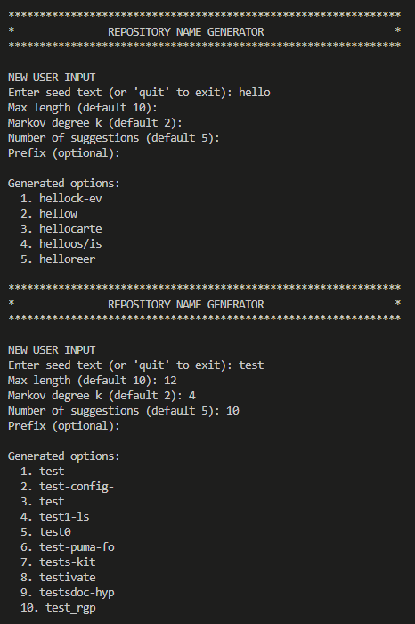
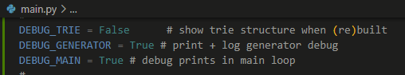
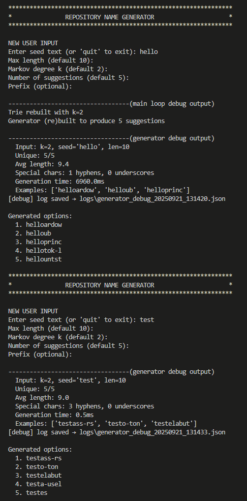

# repo-name-generator

Aineopintojen harjoitustyö: Algoritmit ja tekoäly (2025)

***sisältö***
- [Yleiskuvaus](#yleiskuvaus)
- [Asennus & käynnistys (Poetry)](#asennus--käynnistys-poetry)
- [Ohjelman toiminta ja käyttö](#ohjelman-toiminta-ja-käyttö)
- [Toiminnan analyysi ja tarkistukset](#toiminnan-analyysi-ja-tarkistukset)
  - [Debug-tulostukset](#debug-tulostukset)
  - [Notebook-raportointi](#notebook-raportointi)
  - [Automaattiset testit](#automaattiset-testit)
- [Suorituskyky](#suorituskyky)

---

### Yleiskuvaus

> Nimigeneraattori (repo-/projekti-/pakettinimet) joka oppii k-gram Markov -mallin trie-rakenteella.     
> Sovellus oppii k-gram -pohjaisen merkkitason Markov-mallin suuresta määrästä oikeita repo-/pakettinimiä ja tuottaa uusia, dataa muistuttavia nimiehdotuksia.  
> Ydin toteutetaan omalla trie-rakenteella, jossa jokaiselle k-grammille talletetaan seuraavan merkin frekvenssijakauma (+ erillinen `<EOS>` sanan päättymiseen).  
> Generointi voidaan siementää (seed), tuloksia voi tarkastella debug-lokeista, ja lokeja voi analysoida mukana tulevalla Jupyter-notebookilla.

Keskeisiä ominaisuuksia:
- **k-aste valittavissa**: Kuinka pitkälle taaksepäin katsotaan kirjamia, löytäkseen todennäköinen seuraava kirjain (esim. 2–4)
- **Seed-pohjainen generointi**: Tulos alkaa annetusta siemenestä (käyttäjän määrittämä aloitus sana)

Muita huomioitavia ominaisuuksia:
- **Välimuisti rakenteille**: Trie rakennetaan uudelleen vain jos k muuttuu; generaattori rakennetaan uudelleen vain jos sen asetukset muuttuvat
- **EOS-tuki**: Malli oppii todennäköisen sanan päättymisen
- **Debug-tila**: Tässä tilassa voi seurata trien päällä toimivan generaattorin toimintaa, JSON-lokit logit tästä sijoitetaan automaattisesti hakemistoon `logs/`
- **Notebook raportointi**: Käytetetään logien tarkistamiseen ja sitä kautta generaattorin toiminnan analysointiin (kuinka hyvin onnistutaan tuottamaan merkityksellisä uusia sanoja yms.)  
- **Kattavat automatisoidut testit**: Näiden avulla tarkistetaan että ohjelman toiminta on virheetöntä ja että koodiin tuodutujen muutosten vaikutusta ohjelman toimintaan.
- **Harjoitus-data**: 1.5 miljonaa repositoroiden nimiä, näiden avulla ohjelma oppii sanoja jota muodostaa käyttäjän syötteestä (seed).

---

### Asennus & käynnistys (Poetry)

Varmista Poetry-ympäristö projektin sisään (suositus):
```bash
poetry config virtualenvs.in-project true
```

Asenna riippuvuudet (ensimmäisellä kerralla):

```bash
poetry install
```

HUOM: Jos `poetry shell` antaa seuraavanlaisen virheen `Split-Path ... Cannot bind argument to parameter 'Path' because it is null`, ohita aktivointi ja käytä suoraan `poetry run`, tai aja korjausskripti:

```powershell
# vaihtoehto 1: ohita aktivointi
poetry run pytest -q

# vaihtoehto 2: korjaa venvin activate.ps1 ja käytä shelliä
pwsh -File .\scripts\patch-activate.ps1
poetry shell
```

Käynnistä poetry:

```bash
poetry shell
```

Käynnistä sovellus:

```bash
python -m src.main
```

---

### Ohjelman toiminta ja käyttö

**Toiminta:**
Pääsilmukka on tiedostossa `src/main.py`: hyödyntäen muiden tiedostojen funktioita se kysyy parametrit, rakentaa/kierrättää trien ja generaattorin, generoi `n` kappaletta ehdotuksia ja tulostaa ne.

**Generoinnin logiikka:**

Suunnitteluvaiheessa on myös hahmoteltu ohjelman toimintaa, näitä aluvaiheen hahmotelmia voi katsoa tiedostosta `docs/Testausdokumentti.md`  
Pääpiirteittäin generoinnin logiikka toimii seuraavasti:

  1. *Trie-rakenne*: Harjoitusdata tallennetaan trie-puuhun, jossa jokainen k-grammi (k peräkkäistä merkkiä) muodostaa polun. Esimerkiksi sanasta "hello" k=2:lla tallennetaan: "he"→'l', "el"→'l', "ll"→'o', "lo"→`<EOS>`.

  2. *Todennäköisyyspohjainen valinta*: Kun generoidaan uutta sanaa, katsotaan viimeisiä k merkkiä (konteksti) ja haetaan triestä kaikki mahdolliset seuraavat merkit frekvensseineen. Esim. jos "he" esiintyy datassa 100 kertaa joista 60 kertaa seuraa 'l' ja 40 kertaa 'a', niin 'l' valitaan 60% todennäköisyydellä.

  3. *K-asteen vaikutus*: 
   - k=2: Katsoo 2 merkkiä taaksepäin → satunnaisempia tuloksia
   - k=3: Katsoo 3 merkkiä taaksepäin → koherentimpia sanoja
   - k=4: Katsoo 4 merkkiä taaksepäin → hyvin dataa muistuttavia nimiä

  4. *Painotettu arponta*: Seuraava merkki valitaan kumulatiivisella summalla - jos "he":n jälkeen tulee {'l':60, 'a':30, 'x':10}, arvotaan luku 1-100 ja valitaan merkki sen mukaan mihin väliin osuu (1-60='l', 61-90='a', 91-100='x').

Välimuisti (cache):
- Trie rakennetaan vain jos `k` vaihtuu (tai trietä ei ole vielä).
- Generaattori rakennetaan vain jos sen asetukset vaihtuvat (esim. ehdotusten määrä), muuten sama olio vain päivitetään uuteen trieen.

Harjoitusdatan rajaaminen:
- Trien rakentamisessa käytetyn harjoitusdatan määrää on myös mahdollista rajata.
- Tämä toiminto on hyödyllinen esimerkiksi jos halutaan tarkastella trien rakennetta debug-tulostuksella, se ei ole käytännössä (ainakaan suoraan käyttöliittymästä) mahdollista ilman että harjoitusdatan määrää rajoitetaan.
- Jos harjoitusdatan määrää rajoitetaan täytyy myös Trie rakentaa uusiksi.

Seuraava kuva havainnollistaa ohjelman rakennetta.


**Ohjelman käyttö:**

Käynnistyttyä ohjelma kysyy: 
- sanaa josta aloittaa generointi (seed), 
- sanan pituuden, 
- k-asteen (kuinka monta kirjainta katsoa taaksepäin kun päätellään seuraava kirjain) 
- kuinka monta esimerkkiä tulostaa.
- mahdollisen prefiksin (esimerkiksi annetaan seed hello, 10, 2, prefix: hi- ... tulostuu: hi-hello-rose)

Esimerkkivirta:
1. Syötä seed (esim. `re`), `max_length` (esim. `12`), `k` (esim. `3`), valinnainen prefix (esim. `sys-`).
2. Saat listan ehdotuksia; jos annoit prefiksin, se lisätään jokaiseen.
3. Kun ajat uudelleen samalla `k`-arvolla, trie kierrätetään (nopeampi).

HUOM: Mitä wsuurempi k-aste sitä enemmän generoitu sana muistuttaa generoinnissa käytettyjä testi-data sanoja.  

Allaoleva kuva havainnollistaa UIn käyttöä:



---

### Toiminnan analyysi ja tarkistukset 

**Debug tulostukset**

`src/main.py` sisältää liput:
- `DEBUG_TRIE = True` → trien rakenteen tulostusta (kun (uusiksi) rakennetaan)
- `DEBUG_GENERATOR = True` → tietoja generoinnista, tulostus consoliin ohjelman ajossa sekä JSON-lokitus
- `DEBUG_MAIN = True` → pääsilmukan print lauseet (tietoa tapahtuma-etenemisestä pääsilmukassa)

Seuraava kuva havainnollistaa debug tulostusta konsoliin:

Aseta debug päälle main.py tiedostosta



Konsoliin tulostuu debug tiedot



Konsoliin tulostuksen lisäksi, lokit syntyvät `logs/`-hakemistoon nimellä:
`generator_debug_YYYYMMDD_HHMMSS.json`

Rakenne (esimerkki):
```json
json{
  "timestamp": "2025-09-20T12:34:56.789012",
  "k": 3,
  "seed": "re",
  "max_length": 12,
  "n": 5,
  "samples": ["react-cli", "re-core", "..."],
  "analysis": {
    "unique_count": 5,
    "total_count": 5,
    "avg_length": 9.8,
    "hyphen_count": 3,
    "underscore_count": 0,
    "all_start_with_seed": true,
    "empty_count": 0,
    "was_trie_create": 1,
    "was_generator_create": 1,
    "generation_time": 6334.5,

  }
}
```

**Notebook-raportointi**

Mukana on notebook lokien analysointiin: `debug_statistics.ipynb`.

Poetry ympäristössä notebookin saa käyttöön seuraavasti.

Ajaa komento:

```bash
poetry add ipykernel --group dev
```
Sitten valitse vs-code:sta kerneliksi "repo-name-generator (poetry)".


Notebook lukee logs/*.json, muodostaa pandas DataFramet ja piirtää peruskuvaajia (matplotlib).

NOTE-TO-SELF: tähän automaattista syötettä eri arvoilla, jotta on enemmän dataa saatavilla logituksen raportointiin

**Automaattiset testit**

Tässä osassa kerrotaan lyhyesti ohjelman automaattisesta testauksesta.  
Tästä on kerrottu tarkemmin tiedostossa `docs/Testausdokumentti.md`

Kun olet poetry shell:issä seuraava komento suorittaa testit.

```bash
pytest tests
```

Tämä komento tulostaa tekstitaulukon ja listaa puuttuvat rivit ("term-missing")

```bash
pytest --cov=src --cov-branch --cov-report=term-missing
```

Tämä komento generoi HTML-raportin hakemistoon htmlcov/ (avaa htmlcov/index.html selaimessa)

```bash
pytest --cov=src --cov-branch --cov-report=term-missing --cov-report=html
```

Voit avata raportin komennolla

```bash
start .\htmlcov\index.html
```

**Koodin staattinen analyysi (Pylint)**

Ohjelman koodin laadun ja tyylin tarkistamiseen käytetään `Pylint`-työkalua. Se analysoi koodia staattisesti eli ilman ohjelman ajamista.   
Pylint etsii mahdollisia virheitä, puutteita ja tyylioppaan vastaisia merkintöjä, jotta koodista tulee siistimpää ja helpompaa ylläpitää.

Pylint on asennettu kehitysympäristön riippuvuutena. Aja komento pylint src/ nähdäksesi raportin.

```bash
pylint src/
```

---

### Suorituskyky

Ajallisesti kallein osa on trien rakentaminen. Kaikki myöhemmät nimigeneraatiot ovat lähes välittömiä.

- **Trien rakentaminen:** Kun ohjelman ajaa ensimmäistä kertaa tai muuttaa `k`-arvoa, rakennetaan uusi trie. Tämä on prosessin hitain vaihe, koska ohjelman täytyy käsitellä koko opetusdata. *hello*- ja *hat*-esimerkeissä tämä kesti noin 7 sekuntia (7022,5 ms ja 6966,5 ms). Tämä alkuvaiheen asetus on odotettavissa oleva kertaluonteinen kustannus.

- **Generaattorin rakentaminen (trien uudelleenkäyttö):** Kun kasvataan ehdotusten määrää, esimerkiksi 5:stä 10:een, generaattori rakentuu uudestaan. Aika on vain noin 0,5 ms generaattorin uudelleen rakentamisessa. Tämä osoittaa, että generointiprosessi on tehokas ja skaalautuu hyvin pyydettyjen nimien määrän kasvaessa.

- **Välimuistista ajot (trien uudelleenkäyttö):** Kun ohjelman ajaa uudelleen samalla `k`-arvolla ja asetuksilla, trie ja generaattori kierrätetään. Generointiaika putoaa millisekunnin murto-osaan (0,0 ms). Tämä vahvistaa, että välimuistilogiikka toimii ilman viivettä.