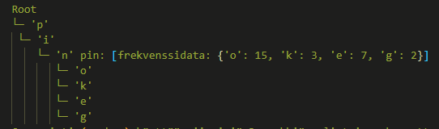
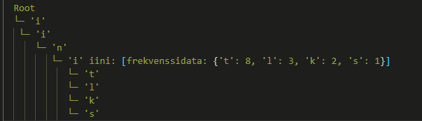

# Määrittelydokumentti — repo-name-generator

## Hallinnolliset tiedot

- **Opinto-ohjelma:** Tietojenkäsittelytieteen kandidaatti 
- **Projektin kieli:** Englanti koodi:ssa, suomi dokumentit ja raporteissa  
- **Ohjelmointikieli:** Python  
- **Muut osatut kielet:** Java (käytöstä pitkä aika), Javascript (en hyvin), C# (en hyvin)

---

## Yleinen kuvaus suunnitellusta toteutuksesta

Tavoitteena on toteuttaa **nimi-/handle-generaattori** (esim. repo-, projekti- ja järjestelmänimet), joka tuottaa ehdokkaita opetusdatasta oppimansa **k-gram Markov-mallin** avulla. Malli on toteutettu **trie -rakenteella**, jossa jokainen k-gram vastaa seuraavien merkkien frekvenssijoukkoa. Malli tuottaa sanoja jotka muistuttavat opetusdataa, mutta tämän pääasiallisena rajauksena on samanlaisuus täsmäytyssanaan, jonka käyttäjä pystyy syöttämään. 
Tämän päälle tulee **eksplisiittinen suodatuskerros** (sallitut merkit, mahdollinen prefix/suffix, samankaltaisuuteen perustuva suodatus). Painotus on algoritmisessa ytimessä (tietorakenne ja tehokas lisäys/haku ja painotettu otanta).

> Vaikka nimi painottaa repositoriota, generaattori on yleiskäyttöinen myös muihin “handleihin”.

## Data

Harjoitusdata kerätään oikeista repo-/projektinimistä (esim. GitHubin trending/release-nimet), jotta malli oppii teknisen nimenannon rakenteita (”-cli”, ”-api”, ”-tools”, väliviivat jne.).

## Esimerkkejä toiminnasta

Muutama yksinkertaistettu esimerkki käytöstä ja toiminnasta.

### (1) Ensimmäinen esimerkki

**Käyttäjän syöttö**  
- prefix: `sys-`  
- ei_sallitut: `CAPITAL_LETTERS`  
- pituus: `7` (ei sisällä prefixiä)  
- täsmäytyssana: `pingviini`  
- seed (merkkejä alusta): `3` *(jos tyhjä → oletus `min(k, len(match))`)*
- markovin aste: `3` (kuinka monta kirjainta katsotaan taaksepäin)

**Esikäsittely**
- rakennetaan trie tietorakene uusiksi koostuen harjoitusdatasta, k-asteella  
  - Trie kun k=3
  - Jokainen solmu sisältää frekvenssit jopa 3 merkin polulle, josta seuraaja valitaan 
  
- Generointi (markov) käyttää viimeisiä 3 merkkiä, eli trie rakennettu sitä varten.

**Generointi**  
- `raw_seed = "pingviini"[:3] = "pin"`  
- **Konteksti** = siemenen viimeiset `k` merkkiä → `"pin"`  
- Tuotos alkaa siemenellä: `current = "pin"`  
- Sitten jatketaan Markovilla, kunnes pituus 7 täyttyy:  
  - `"pin" -> o` → `pino`  
  - `"ino" -> a` → `pinoa`  
  - `"noa" -> j` → `pinoaj`  
  - `"oaj" -> a` → `pinoaja`

**Suodatus/modifiointi** 
- Liitetään prefix: `sys-` → `sys-pinoaja`  
- Sallitut merkkijoukot: yksinkertaisella logiikalla poistetaan ei-sallittuja sanoja
- Samankaltaisuuteen perustuva jatkosuodatus (esim. bigram-Jaccard): generoidaan n≈100 ja valitaan esim. 10 parasta valmiin kirjasto-implementaation avulla

**Mahdollisia tulosteita**  

> sys-pinoaja
>
> sys-pinvasta
>
> sys-pingbot

### (2) Toinen esimerkki

**Käyttäjän syöttö**  
- prefix: `sys-`  
- ei_sallitut: `CAPITAL_LETTERS`  
- pituus: `13` (ei sisällä prefixiä)  
- täsmäytyssana: `pingviini`  
- seed (merkkejä alusta): `9` *(= koko sana; jos tyhjä → oletus `min(k, len(match))`)*
- markovin aste: `4` (kuinka monta kirjainta katsotaan taaksepäin)

**Esikäsittely**
- rakennetaan trie tietorakene uusiksi koostuen harjoitusdatasta, k-asteella 
  - Trie kun k=4
  - Jokainen solmu sisältää frekvenssit jopa 4 merkin polulle, josta seuraaja valitaan 
  
  - Generointi (markov) käyttää viimeisiä 4 merkkiä, eli trie rakennettu sitä varten.
  

**Generointi**  
- `raw_seed = "pingviini"`  
- **Konteksti** = viimeiset `k=4` merkkiä → `"iini"`  
- `current = "pingviini"`  
- Jatketaan Markovilla kunnes pituus 13 täyttyy (esim.):  
  - `"iini" -> t` → `pingviinit`  
  - `"init" -> u` → `pingviinitu`  
  - `"nitu" -> u` → `pingviinituu`  
  - `"ituu" -> t` → `pingviinituut`  
  - `"tuut" -> i` → `pingviinituuti` 

**Suodatus/modifiointi**  
- Prefix: `sys-` → `sys-pingviinituutti` 
- Sallitut merkkijoukot: yksinkertaisella logiikalla poistetaan ei-sallittuja sanoja
- Samankaltaisuuteen perustuva jatkosuodatus (esim. bigram-Jaccard): generoidaan n≈100 ja valitaan esim. 10 parasta valmiin kirjasto-implementaation avulla

**Mahdollisia tulosteita**  

> sys-pingviinituutti
>
> sys-pingviini-cli
>
> sys-pingviini-labs

**Huom:** Jos käyttäjä ei anna `seed`-arvoa, käytetään oletuksena  `raw_seed = match[:min(k, len(match))]`.

**Siemenen (seed) fallback-strategia**

Jos käyttäjän antama siemen (`raw_seed`) ei esiinny harjoitusdatasta rakennetussa triessä:
1. Backoff lyhyempään prefiksiin: kokeile `raw_seed[:s]` pituuksia `s = min(k, len(raw_seed)), min(k, len(raw_seed))-1, ..., 1` kunnes löytyy distribuutio
2. Satunnainen aloitus: jos mikään prefiksi ei toimi, aloitetaan tyhjästä (normaali Markov-generointi)
3. Varoitus käyttäjälle: ilmoitetaan jos alkuperäinen siemen ei toiminut ja mitä strategiaa käytettiin

Esimerkki:
- Käyttäjä: seed="pingviini", k=3
- Jos "pin" löytyy triestä → käytä sitä
- Jos ei, kokeile "pi" → jos löytyy, käytä sitä  
- Jos ei, kokeile "p" → jos löytyy, käytä sitä
- Jos ei mitään → aloita satunnaisesti

---

## Ohjelman toteutuksesta

### (1) Komponentit

UI:na käytetään komentoriviä (mahd. kevyt CLI).

Ratkaisun ydin on Markov-malliin ja trie-rakenteeseen perustuva generointi ja käynnistää generoinnin mahdollisuuksien mukaan täsmäytyssanan alusta.

Käyttäjän valintaan liittyvät eksplisiittiset toiminnot, esim. prefix.

Yksinkertaiset rajaukset (merkkijoukko/pituus) tehdään logiikkapohjaisella suodatuksella. 

Lisäksi (valinnainen) samankaltaisuussuodatus (esim. bigram-Jaccard tai Levenshtein-etäisyys) tehdään valmiin kirjasto-implementaation avulla, jotta aivan satunnaiset ehdokkaat karsiutuvat. Huom: tämä ei myöskään takaa semanttista “mielekkyyttä”, vaan ohjaa listaa kohti täsmäytyssanaa ja harjoitusdatan rakenteita. Toteutetaan tämä vaihe koodissa siten että se on vaihtoehtoinen, niin voi helpommin testata itse generoinnin tuloksia.

### (2) Syötteet ja tulosteet
- **Syöte:**  
  - Opetusdata (UTF-8 tekstitiedosto, rivi per sana/termi).  
  - Rajauksen parametrit: `k` (aste), ehdokasmäärä `n`, pituusrajat, sallitut merkit, (valinn.) `prefix/suffix`.
  - Täsmäytykseen käytettävä sana. 
- **Tuloste:** Lista generoituja nimiä, jotka vastaavat täsmäytys-sanaa, sekä läpäisevät annetut ehdot.

### (3) Algoritmit ja tietorakenteet
- **k-gram Markov (merkkitasolla)**: todennäköinen seuraava merkki valitaan edellisten `k` merkin perusteella.
- **Trie**: 
  – Tietorakenne: trie, jonka solmuun tallennetaan siihen johtavan prefiksin frekvenssidata seuraajista.
  – Painotettu satunnaisvalinta seuraajista frekvenssien perusteella
- **Rejection sampling** rajojen toteuttamiseen (kevyt kerros).

### (4) Aika- ja tilavaativuudet (viitteellinen)
- **Koulutus (trie-populointi):** jokainen sana tuottaa O(L) k-grammia → **O(∑L)**.  
- **Haku/generointi:** Per merkki haetaan seuraajat trie:stä O(k) ajassa, eli sanan pituudelle m → O(m·k). Koska k on pieni, käytännössä O(m).  
- **Muisti:** tallennettujen avainten määrä ≈ uniikkien k-grammien määrä + seuraajafrekvenssit → pahimmillaan O(|Σ|^k), käytännössä paljon vähemmän koska kaikki mahdolliset k-grammit eivät esiinny.

### (5) Työn ydin

Projektin ydin on seed-pohjainen ja valinnainen k-gram, Markov-generaattori, joka yhdistää merkkitasoisen Markov-mallin käyttäjän antamasta täsmäytyssanasta aloittavaan generointiin. Algoritmi rakentaa k-grammien frekvenssimallin trie -rakenteella, toteuttaa painotetun satunnaisvalinnan seuraavista merkeistä, ja käyttää fallback-strategioita kun alkuperäinen siemen ei toimi harjoitusdatassa. Tämä yhdistelmä muodostaa generointimoottorin, joka tuottaa opetusdataa muistuttavia mutta kohdennettuja nimiä.

### (6) Rajaukset
- Ei ulkoisia NLP-kirjastoja mallin oppimiseen generoinnissa; Pythonin peruskirjastot ok.  
- Samankaltaisuusmetriikat toteutetaan valmiiden Python-kirjastojen (esim. textdistance) avulla, mutta generointimalli (Markov+trie) on oma toteutus

### (7) Huomiot

- Projektin toiminnallisuudet ovat aika laajat. Voi olla että jos projektista tulee liian työläs joistain lisäominaisuuksista joudutaan luopumaan, kuten samankaltaisuuteen perustuva jatkosuodatus.

---

## Lähteet

- Trie: https://en.wikipedia.org/wiki/trie  
- Markov chain (k-gram): https://en.wikipedia.org/wiki/Markov_chain
- Weighted random sampling: https://en.wikipedia.org/wiki/Weighted_random_sampling
- Jaccard similarity: https://en.wikipedia.org/wiki/Jaccard_index
- Levenshtein distance: https://en.wikipedia.org/wiki/Levenshtein_distance
- N-gram language models: https://en.wikipedia.org/wiki/N-gram
- Text generation: https://en.wikipedia.org/wiki/Natural_language_generation
- String metrics: https://en.wikipedia.org/wiki/String_metric
