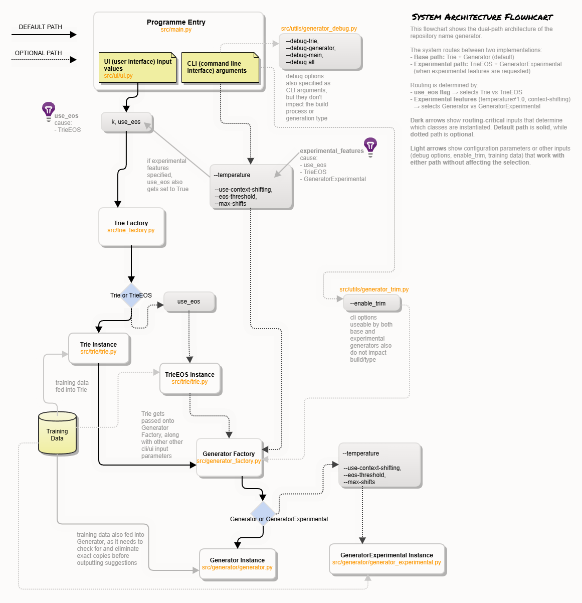

# Viikkoraportti 4
**Käytetty aika:** 12–14 tuntia

***

## Mitä olen tehnyt tällä viikolla?

**1. Dual-path arkkitehtuurin implementointi**

Opettajan kanssa käydyn palaverin jälkeen, kävi selväksi että lisäominaisuudet esimerkiksi temperature tai EOS siirtymät) voivat aiheuttaa sen että luonnollisia siirtymiä vähennetään generoinnissa, mikä tarkoittaa että harjoitusdatan opetukseen käytettävä määrä vähenee. Siten paras ratkaisu saattaa olla trie mahdollisimman yksinkertainen Trie jonka rakenteita kunnioitetaan mahdollisimman paljon genroinnissa. En kuitenkaan halunnut kokonaan luopua ratkaisuista jotka antavat mahdollisuuden enempään vaihteluun ratkaisun muodostamisessa. Siksi tein kaksipolkuisen ratkaisun jossa kaikki default:illa käytettävät arvot rakentavat ja käyttävät trietä ilman eos-päättymisten lisäämistä seuraavina kirjaimina, ja generointi tapahtuu käyttäen satunnaisuudessa trien luonnollisia seuraavia jakaumia. Antamalla komentorivistä argumentteina ohjelmalle parametreja saa kuitenkin käynnistettyä eri version generaattorista jossa on laajemmin mahdollisuus asettaa eri generoinnin tapoja, jotka osaltaan myös usein hyödyntävät trien EOS-ominaisuutta. Siksi rakennetaan EOS-trie jos ollaan käynnistetty ohjelma tässä "experimental"-moodissa. 

Seuraava kuva havainnollistaa nykyistä rakennetta.

* Peruspolku: `trie.py` + `generator.py` (ilman EOS/temperature)
* Kokeellinen polku: `trie_eos.py` + `generator_experimental.py`
* Factory-pattern: reitittää automaattisesti oikeaan toteutukseen.

**2. Duplikaattisuodatus ja loop-suojaus**

* Lisäsin exact-match suodatuksen molempiin generaattoreihin.
* Toteutin `max_attempts = n * 10` suojauksen estämään ikuiset silmukat korkeilla *k*-arvoilla.
* Generator palauttaa osittaisen tuloksen tai tyhjän listan tarvittaessa.

**3. Testien parantaminen**

* Lisäsin uusia testejä ja järjestin testit kansioittain testaamaan trietä tai generaattoria
* Testien tyypit testaavat:
    - perusominaisuuksia
    - suorituskykyä
    - generoinnin/trien laatua (oikealla datalla)
    - lisäominaisuuksi
* 25 testiä läpi, 50% kokonaiskattavuus.
* Trie: 96% kattavuus (terminaalisolmut mukaan lukien).
* Generator: 61% kattavuus (duplikaattisuodatus testattu).
* Testikattavuus on alhainen koska on monta tiedostoa ja luokkaa, eikä kaikkien testaaminen ehkä ole yhtä tärkeää
* Yritän ensin saada generaattorin testikattavuutta ylös, minkä jälkeen keskityn siihen että myös muuta koodia testataan ainakin kattavemmin

**4. Toiminnallisuuden todentaminen**

Ajettua ohjelmaa uusimalla koodin versiolla tein seuraavat havainnot.

* **Perusgenerointi** 
    * Input:k=4, EOS=False, Max length: 10
    * Seed: "hello"
    * Generated: `hello-worl, hello_haya, hello-copy, hello-fron, hellow-cha`
    * Huomioita: 
        - Sanat katkeavat helposti maksimipituuden kohdalla, mikä vaikeuttaa todentuntuisten sanojen generointia.
* **EOS-generointi** 
    * Input: k=4, EOS=True, Max length: 15
    * Seed: "hello"
    * Generated: `hello-world-ver, helloython-fil, hello-search, hello-service`
    * Huomioita: 
        - Luonnolliset sanarajat säilyvät paremmin. Kuitenkin vaatii enemmän testausta jotta voidaan todentaa mitä haittapuolia tällä on.
        - Kun k on asetettu arvoon 4 ja samat sanat poistettu, generoinnin tulokset vaikuttavat yleisesti ottaen aika hyviltä.
        - Tarkistettu myös varmuudeksi vs-coden search ominaisuudesta, että data ei tosiaan sisällä näitä sanoja.
* **Korkea k** 
    * Input: k=5, Max length: 15
    * Seed: "hello"
    * Generated: `hello_devi, hello-zhp, hello-sugg, hellostz20`
    * Huomioita: 
        - Kun k asetetaan 5:dksi tulee selkeästi enemmän samoja sanoja generoinnissa kestää pidempään.
        - ~10+ sekuntia (enemmän hylättyjä duplikaatteja).
* **Temperaturen asettaminen** 
    * k=4, Max length: 15, --temperature 0.4 
    * Seed: "hello"
    * Generated: `hello-work, hello-work-comp, hello-work-pars, hello-workflow, hello-working`
    * Huomioita: 
        - temperature ominauisuus antaa satunnaisuuden hienosäätämismahdollisuuden
        - Vaihtelemalla kuinka uskollisesti satunnaisuus seuraa luonnollista jakaumaa (temperature), vaikuttaisi että voidaan hienosäätää generointia tuottamaan datalle uskollisempia generointeja, mutta ehkä ilman niin radikaaleja muutoksia kuin uusi k-aste saattaa tuoda mukanaan
        - Asettamalla temperature välille 0.4-0.8 tuotti laadukkaita sanoja
        - Tällöin siis asetetaan että ne kirjaimet joita satunnaisessa seuraamisessa on todennäköistä seurata on vielä todennäköisempää
        - Tämä luonnollisesti myös tekee sen että tulee enemmän samoja sanoja, ja generoinnissa kesti pidempään (~10+ sekuntia) 
        - Voi myös huomata että tietyt kirjaimet tulevat lähes aina valituksi (llo-w)
        - ~10+ sekuntia (enemmän hylättyjä duplikaatteja).
* **Trim-toiminnallisuus**
    * k=4, Max length: 15, --temperature 0.4, --enable-trim
    * Seed: "hello"
    * Generated: `hello-work, hello-work-comp, hello-work-pars, hello-workflow, hello-working`
    * Huomioita: 
        - Jos tokenin sijainti on tarpeeksi perällä sanassa poistetaan kirjaimia tokeniin asti  (hello-work-pars-hyg -> hello-work-pars)
        - Vaikutelma on että tämä voi myös antaa luonnollisemmalta tuntuvia sanoja, toisaalta saattaa myös altistaa ennalta arvaamattomille huonoille generoinnille
        - ei vaikutusta aikavaativuuteen

***

## Miten ohjelma on edistynyt?
* Selkeä erottelu perus- ja kokeellisen välillä.
* Duplikaattisuodatus toimii molemmissa poluissa.
* Ohjelma generoi tietyllä asetuksilla sanoja jotka ovat luonnollisilta vaikuttavia (repo-nimiä) ja eivät ole duplikaatteja.
* Ohjelmaa ei ole kattavasti testattu eri syötteillä eikä analysoitu suuremilla määrillä syötteitä (tämä on mielessä tehdä seuraavana).
* Batch-testausmahdollisuus toteutettu ja notebook olemassa analyysia varten.
* Testit kattavat kriittiset polut, vaikka testikattavuutta tulee parantaa.
* Arkkitehtuurikaavio dokumentoi rakenteen.

***

## Mitä opin tällä viikolla?
1. **Terminal k-gram sisällyttäminnen**: "lo" on k-grammi sanassa "hello" vaikka sillä ei ole seuraajaa. Päädyin sisällyttämään terminaalit tyhjillä `next_counts` konsistenssin vuoksi.
2. **Loop-suojauksen tarve**: Korkea *k* (≥5) + pieni datasetti = paljon duplikaatteja. Ilman suojausta generator jumittuu.
3. **Factory pattern -arvo**: Dual-path arkkitehtuuri factory-patternilla mahdollistaa sekä tehokkaan perustoteutuksen että kokeiluominaisuudet ilman että ne sotkevat toisiaan. 
4. **Laadun mittaamisen subjektiivisuus**: Tietyt kertoimet ja novelty-testit antavat lukuja joita verifioida, mutta "hyvä" repo-nimi voi lopulta olla hyvin subjektiivinen.

***

## Mikä jäi epäselväksi tai tuotti vaikeuksia?
* **Suorituskyky**: Generointi hidastuu merkittävästi kun duplikaatteja hylätään paljon.
* **Optimointi**: Optimointi on haastavaa: monet parametrit (esim. 12% boundary window) ovat empiirisiä. Keinotekoiset optimoinnit eivät aina sovi luontevasti, mutta ilman niitä vaikutusmahdollisuudet ovat rajalliset
* **Laadun testaaminen**: Miten määrittää laatu testeissä ja objektiivisesti todeta tietyn luokan tuloksia olevan parempi kuin toinen, kun tuloksiin mahtuu paljon tulkinnanvaraisuutta ja vaihtelua
* **Test coverage vs. käytännöllisyys**: Mikä riittää (50%) kun testaamaton koodi on UI/debug?

***

## Mitä teen seuraavaksi?
1. **Logeihin perustuvaa analyysiä**: Analysoin batch-testien JSON-lokit, vertailen eri *k*/temperature/EOS kombinaatioita.
2. **Käyttöohjeet ja dokumentaatio**: Esimerkiksi dokumentoin optimaaliset parametrit eri käyttötapauksille. Yleisesti siistin projektia niin että se on enemmän esitettävässä kunnossa ensi viikon vertaisarviointia varten.
3. **Vertaisarviointi**: Levenshtein-etäisyys tai n-gram similarity.
4. **Yksikkätestit**: Yritän parantaa testikattavuutta ja esimerkiksi lisätä testejä jotka mittaavat tulosten laatua. 

***

## Palautepyyntö 
* Onko testikattavuus riittävä jossain osia koodia, onko tiettyjä alueita/koodin osia joissa testausta tulisi varsinkin kohentaa?
* Kannattaako "near-duplicate suodatus" toteuttaa vai riittääkö exact-match? Mietin esimerkiksi jos sana on tietyn pituinen, yhdellä tai muutamalla kirjaimella eroavat voisi rajata pois, mikä voisi vahvistaa enemmän omaperäisten sanojen generointia.
* Onko tässä suunniteltu kahden haaran rakenne ok tehtäväantoa varten. Olen yrittänyt säilyttää perusominaisuudet jotka tekevät tehokkaan trien ja generattorin mahdollisimman erillään kaikesta lisäominaisuuksista, mutta varsinkin kun ohjelma tuntuu kokoajan laajenevan, mietin että onko tässä kurssin kannalta jokin tietty suunnanmuutos joka minun on tehtävä, vai vaikuttaako suurinpiiretin ok:lta?  