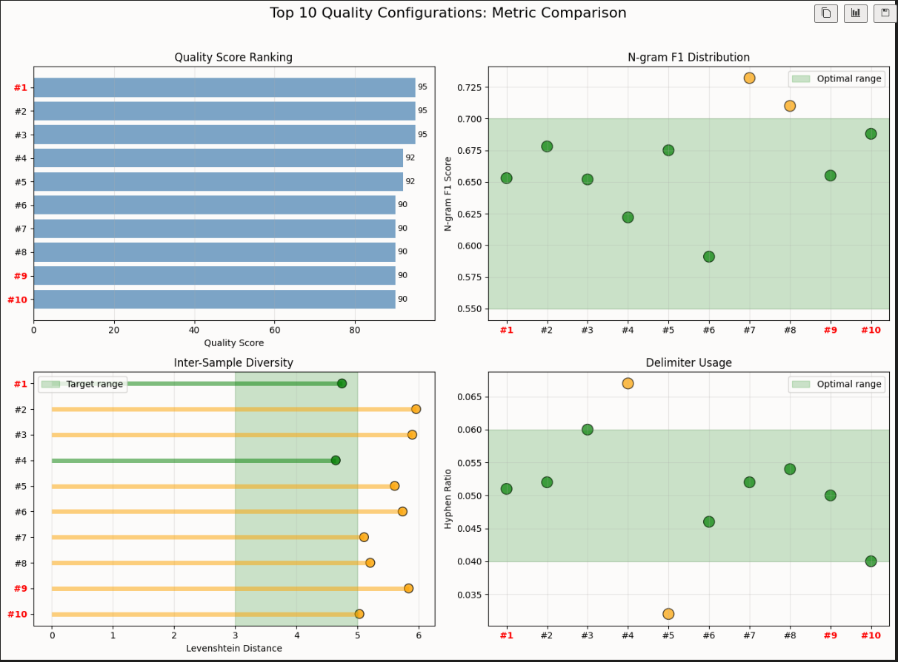

# Viikkoraportti 5
**Käytetty aika:** 10–12 tuntia

***

## Mitä olen tehnyt tällä viikolla?

**1. Vertaisarviointi**

Suoritin vertaisarvioinnin projektista. Vertaisarvioinnissa:
* Tutustuin toisen opiskelijan lähestymistapaan samankaltaiseen ongelmaan
* Annoin palautetta koodin rakenteesta, testauksesta ja dokumentaatiosta
* Sain uusia näkökulmia omaan toteutukseeni vertailemalla ratkaisuja

**2. Batch-testien JSON-logien analysointi**

Toteutin kattavan analyysiprosessin batch-testien tuloksille Jupyter Notebookissa:

* **Datan lataus ja esikäsittely**:
  - Latasin JSON-lokit eri konfiguraatiosta (esim. k=2/3/4, temp=0.8/1.0/1.2, EOS=True/False)
  - Jokaisesta konfiguraatiosta generoituja repo-nimiä
  - Yhteensä noin 300 repo-ohjelman ajojen loki-tiedostoa analysoitavaksi

* **Laadullisten metriikoiden kehittäminen**:
  - **N-gram F1 Score**: Mittaa kuinka hyvin generoitu nimi vastaa oikeiden repo-nimien rakennetta (n-gram jakaumat)
  - **Levenshtein-etäisyys**: Mittaa inter-sample diversiteettiä (kuinka erilaisia generoidut nimet ovat keskenään)
  - **Hyphen ratio**: Repo-nimille tyypillinen väliviiva-käyttö (optimaalinen 4-6%)
  - **Length utilization**: Kuinka tehokkaasti max_length hyödynnetään (85-95% optimaalinen, ≥98% = cap-hit artefakti)

* **Laatupisteytysjärjestelmä**:
  - Kehitin painotetun pisteytysjärjestelmän joka yhdistää kaikki metriikat
  - Tunnistin optimaalialueet jokaiselle metriikalle empiirisen analyysin perusteella
  - Laskin quality score -arvon jokaiselle konfiguraatiolle

* **Visualisoinnit**:
  - **Globaalit vertailut** (kaikki konfiguraatiot): N-gram F1 vs. Temperature (K-arvo mukaan), Levenshtein vs. Temperature, Length Utilization vs. Temperature (sekä kokonaisuutena että EOS/Trim-asetuksilla jaoteltuna), Delimiter Usage (hyphens/underscores) vs. Temperature
  - **Top-10 yksityiskohtainen vertailu**: 4-paneelinen kuvaaja (Quality Score, N-gram F1, Levenshtein, Hyphen Ratio) samoille konfiguraatioille, manuaalisesti validoidut top-performerit (#1, #9, #10) korostettuna punaisella
  - **Suorituskykyvertailu**: Top-15 nopeimmat konfiguraatiot (generation time), 4-paneelinen metric breakdown (Quality Score, Generation Speed, N-gram F1, Levenshtein)

* **Keskeiset löydökset**:
  - **k=4**: Odotetusti tuotti tasaisemmin laadukkaampia tuloksia kuin k=3
  - **temperature=1.0-1.2**: Antoi parhaan tasapainon otannassa diversiteetin ja koherenssin välillä (yllättäen parempi kuin matala temp ≤1.0), mutta rajoitettu otoskoko ei mahdollista pidemmälle meneviä johtopäätöksiä
  - **EOS-ominaisuus**: Paransi luonnollisia sanarajoja, mutta trim-toiminnallisuuden boundary detection vaatii vielä hienosäätöä (epäjohdonmukainen morfologinen katkaisu)
  - **Character contamination**: Tietyt konfiguraatiot tuottivat ei-toivottuja merkkejä (`.`, `/`) todennäköisesti tiedostopolkujen takia harjoitusdatassa
  - **Positiiviset havainnot**: 100% seed-tarkkuus, johdonmukaiset rakennemallit (`{seed}-{technology}`), pääosin asianmukainen väliviivakäyttö
  - **Puutteet menetelmässä**: Tiukat pituusrajoitukset (pitkät seedit vs. lyhyt max_length) tuottivat usein vain 2-5 merkkiä seedin jälkeen → rajoitti tulosten avulla tehtävää analyysiä
  - **Anomaliat**: Config #6 (K=3, temp=1.0, base, no EOS/Trim) tuotti `test → tests`, mikä ei pitäisi olla mahdollista ilman EOS/Trim → vaatii lisätutkimusta
  - **Jatkotoimet**: Korkeampi max_length (≥20) analyyseille, token-suodatus polkumerkeille / harjoitusdatan siivoaminen, morfologisesti älykkäämpi boundary detection. Loppukäyttäjälle suositus käytettävistä arvoista parhaaseen tulokseen pääsemiseksi, ja rajoitteiden selkeä ilmaiseminen.

**3. Laatuun perustuvat yksikkötestit**

Notebookin analyysitulosten pohjalta toteutin uusia laatutestejä:

* **Generaattorille (base)**:
  - `test_consistent_seed_produces_similar_patterns`: Varmistaa että sama seed tuottaa rakenteellisesti samankaltaisia tuloksia (pattern learning)
    - Esim. seed "web" → 10 tulosta, Jaccard-similariteetti >0.13 (jaetut bigrammit)
  - `test_output_follows_training_character_distribution`: Tarkistaa ettei generointi tuota merkkikontaminaatiota
    - Esim. ei saa generoida `.` tai `/` merkkejä (polkuartefaktit harjoitusdatasta)

* **Generaattorille (experimental)**:
  - `test_temperature_affects_diversity`: Validoi että korkeampi temperature (1.0-1.2) tuottaa monipuolisempaa outputia kuin matala (0.6-0.8), mitattuna Levenshtein-etäisyyksillä
    - Esim. temp=1.2: mean Levenshtein >8.0, temp=0.6: <6.0
  - `test_output_length_utilization_quality`: Varmistaa että generoidut nimet käyttävät kohtuullista osaa max_lengthista (EOS-adjusted: 55-98%)
    - Esim. max_length=15 → keskimäärin 9-12 merkkiä (60-80%, ei 98% cap-hit)

* **Trielle (EOS)**:
  - `test_trie_learns_delimiter_patterns`: Varmistaa että trie oppii väliviiva-siirtymät oikein ja delimiter ratio on terveellä tasolla
    - Esim. hyphen_ratio 0.02-0.15 
  - `test_trie_eos_enables_early_stopping`: Validoi että terminaaliset k-grammit oppivat EOS-tokenin
    - Esim. ≥50% sanojen loppuista k-grammeista (esim. "ing", "ser") sisältää `<EOS>`
    
Kaikki testit käyttävät oikeaa harjoitusdataa (`training_data.txt`) ja validoivat kvantitatiivisia löydöksiä notebookista.

***

## Miten ohjelma on edistynyt?
* **Empiirinen validointi**: Alustavasti dataan perustuvaa näyttöä siitä, mitkä parametrikombinaatiot toimivat parhaiten, skeä mitä mitattavia eroja ne tuottavat
* **Objektiivisempi laadun arviointi**: Quality score -järjestelmä antaa toistettavan tavan vertailla konfiguraatioita, vaikka siinä löytyy edelleen paljon parannettavaa ja tulkinnanvaraisuutta
* **Testikattavuus**: Uudet laatutestit nostavat testikattavuutta ja varmistavat että laatuun perustuvat löydökset pysyvät voimassa koodin kehittyessä
* **Dokumentointi**: Notebook toimii sekä analysointityökaluna että dokumentaationa optimaalisten parametrien valinnasta
* **Tuotantovalmiuden parantuminen**: Character contamination ja cap-hit artefaktien tunnistaminen auttaa välttämään heikkolaatuista outputia

***

## Mitä opin tällä viikolla?
1. **Kvantitatiivinen laadun arviointi**: Subjektiivisen "hyvä repo-nimi" -käsitteen muuttaminen mitattaviksi metriikaksi (n-gram F1, diversiteetti, delimiter-käyttö) antaa objektiivisen perustan optimoinnille, mutta kärsii helposti vaikeasti asetettavista mittareista. Iteratiivinen lähestymistapa, jossa pisteytykset validoidaan tarkastelemalla, vaikuttaa toimivan suhteellisen hyvin. 

2. **Testien ja analyysin yhteys**: Notebookin löydökset → yksikkötestit -prosessi varmistaa että kertaluontoiset havainnot muuttuvat pysyviksi laatutakeiksi.

3. **Visualisoinnin hyöty**: Esimerkiksi 4-osainen vertailukuva teki monimutkaisesta datasta helposti tulkittavan.

***

## Mikä jäi epäselväksi tai tuotti vaikeuksia?

* **Boundary detection -arkkitehtuuri**: Analyysista kävi ilmi että trim-toiminnallisuus eikä eos itsessään ratkaise kokonaan sanojen epäjohdonmukaisia morfologisia katkaisuja (`validator-clien` vs. `filter-tools`). Mietin tähän eri ratkaisuja.

* **Stokastisen generaattorin testaaminen**: Yritin implementoida analyysin perusteella lisää laatuun perustuvia testejä mutta tässä edelleen haasteita. Miten kirjoittaa robusteja testejä satunnaiselle outputille? Myös kynnysarvojen asettaminen: liian tiukat epäonnistuvat satunnaisvaihtelun takia, liian löysät eivät havaitse regressioita. 

* **Analyysin hyödyntäminen perusrakenteen parantamiseen**: Notebook-analyysi paljasti että tietyt parametrit toimivat paremmin, mutta nämä ovat konfigurointia - eivät kerro miten itse trie/generator-rakennetta pitäisi kehittää. Mietin miten analyysituloksia voisi käyttää parantamaan perus-algoritmeja.

***

## Mitä teen seuraavaksi?

1. **Dokumentaatio**: Parannan ja viimeistelen:
  - Toteutusdokumentti
  - Testausdokumentti
  - Käyttöohje 
    - dokumentoin notebookin löydösten perusteella suositellut parametrit eri käyttötapauksille (esim. "maksimaalinen diversiteetti" vs. "data-uskollinen generointi").
  - Readme
    - Lisään visualisointeja ja esimerkkejä projektin pääsivulle, jotta arkkitehtuuri ja laatutakeet käyvät selväksi.

2. **Testikattavuuden nosto**: Yritän saada generator.py:n kattavuuden yli 75%:iin testaamalla vielä joitain reunatapauksia.

3. **Suorituskykyanalyysi**:  Teen vielä empiirisiä suorituskykymittauksia eri k-arvoilla (esim. genererointiaika, muistinkäyttö) ja dokumentoin tulokset.

4. **Vertaisarvioinnin palaute**: Käyn läpi ja implementoin vertaisarvoinnista saatua palautetta. 

***

## Palautepyyntö 
* Pitäisikö keskittyä enemmän ydinalgoritmin optimointiin (esim. trie-rakenteen tehokkuus, generointialgoritmit) vai riittääkö että parannan ja dokumentoin toimivat konfiguraatiot ja käyttöohjeet? Varmasti yritän molempia joka tapauksessa.